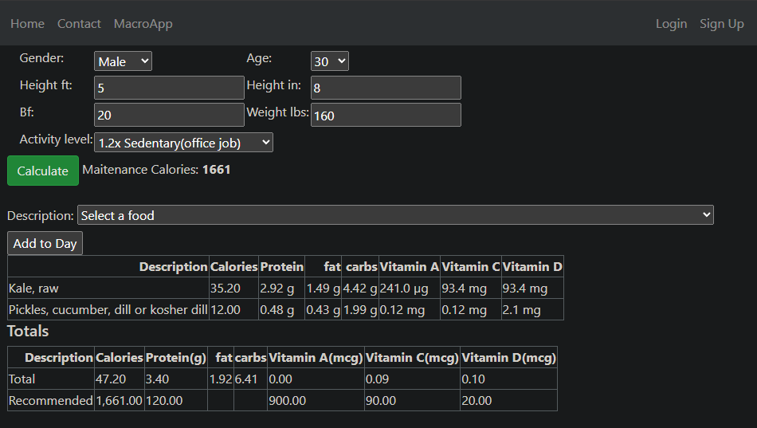

## Abstract

## Django: Vitamin and MacroNutrient App

A personal Python/Django web app project that uses the food nutrition data from the U.S.A FDA API to show the vitamin,macronutrient, and calorie break down for an individual age,height, gender, ect.

## Dealerships Data Table

App Front Page Example As of Feb 2nd 2024



## Data Sources

The recommended Vitamin amount I got from converting this PDF image to a data csv 

https://ods.od.nih.gov/HealthInformation/nutrientrecommendations.aspx#dv

via  https://www.extracttable.com/ to convert the image to a table

## Intresting implementations 

if you are familiar with dataframes and packages like python, note that you can render a table like this directly from a data frame:


``` Python


def my_view(request):
    # Create a pandas DataFrame
    df = pd.DataFrame({
        'Jan': ['3', '6', 'Rec.'],
        'Feb': ['4', '8', 'Wait.'],
        'Mar': ['1', '8', 'Satus.']
    })


    # Convert the DataFrame to HTML
    df_html = df.to_html(index=False)

    # Pass the HTML to the template
    return render(request, 'my_template.html', {'df_html': df_html})


```

Will render with just     {{ df_html |safe }} in the html.

The original dataset from the FDA USA website is much larger than for this project and is converterd to a smaller Json, for example only a few vitamins and protein,fat,and carbs are used for now.

``` json

{
    "description": "Kale, frozen, cooked, boiled, drained, without salt",
    "foodNutrients": [
      {
        "type": "FoodNutrient",
        "nutrient": {
          "number": "204",
          "name": "Total lipid (fat)",
          "rank": 800,
          "unitName": "g"
        },
        "dataPoints": 6,
        "max": 1.34,
        "min": 0.91,
        "median": 1.26,
        "amount": 1.21
      },
      {
        "type": "FoodNutrient",
        "nutrient": {
          "number": "205",
          "name": "Carbohydrate, by difference",
          "rank": 1110,
          "unitName": "g"
        },
        "amount": 5.3
      },
      {
        "type": "FoodNutrient",
        "nutrient": {
          "number": "323",
          "name": "Vitamin E (alpha-tocopherol)",
          "rank": 7905,
          "unitName": "mg"
        },
        "dataPoints": 2,
        "max": 1.84,
        "min": 1.38,
        "median": 1.61,
        "amount": 1.61
      },
      {
        "type": "FoodNutrient",
        "nutrient": {
          "number": "203",
          "name": "Protein",
          "rank": 600,
          "unitName": "g"
        },
        "max": 3.38,
        "min": 2.19,
        "median": 3.09,
        "amount": 2.94
      },
      {
        "type": "FoodNutrient",
        "nutrient": {
          "number": "320",
          "name": "Vitamin A, RAE",
          "rank": 7420,
          "unitName": "\u00b5g"
        },
        "amount": 146
      },
      {
        "type": "FoodNutrient",
        "nutrient": {
          "number": "401",
          "name": "Vitamin C, total ascorbic acid",
          "rank": 6300,
          "unitName": "mg"
        },
        "dataPoints": 3,
        "max": 24.4,
        "min": 10.0,
        "median": 19.0,
        "amount": 17.8
      },
      {
        "type": "FoodNutrient",
        "nutrient": {
          "number": "202",
          "name": "Nitrogen",
          "rank": 500,
          "unitName": "g"
        },
        "dataPoints": 6,
        "max": 0.54,
        "min": 0.35,
        "median": 0.5,
        "amount": 0.47
      }
    ],
    "foodPortions": {
      "amount": 118.0,
      "unitname": "g",
      "total-nutrient-weight-g": 103.1,
      "kcal": 36.0
    }
  },
