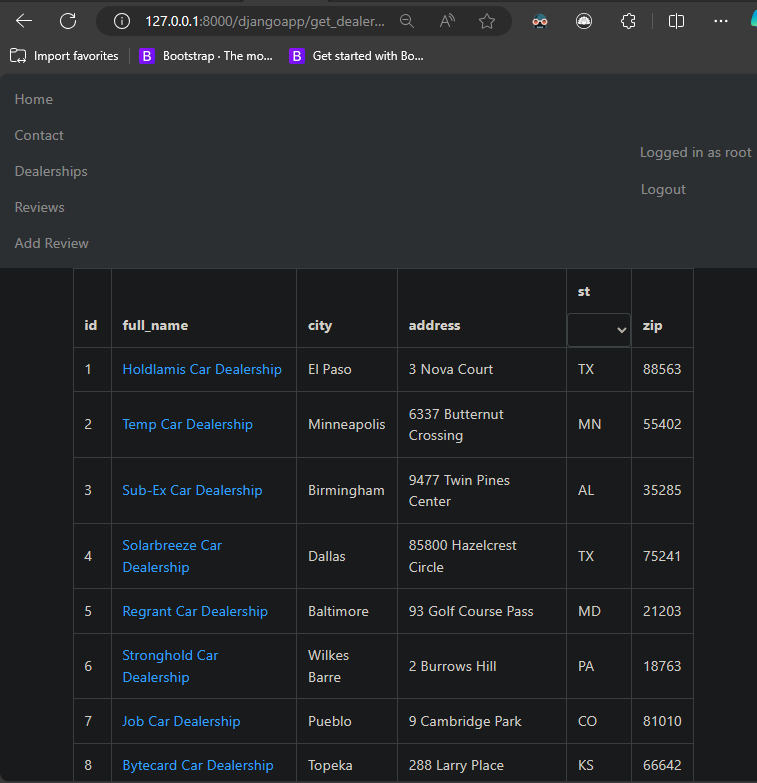
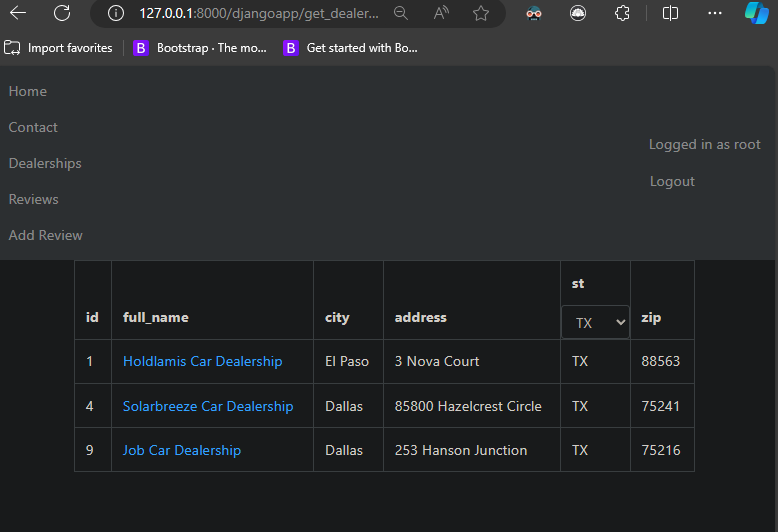
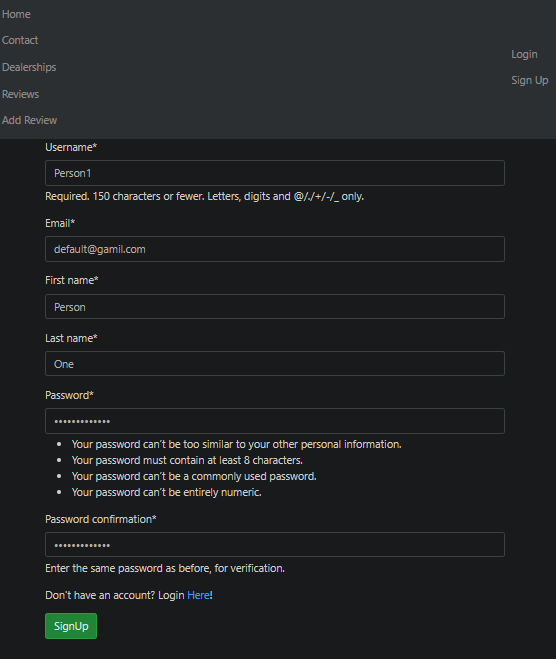
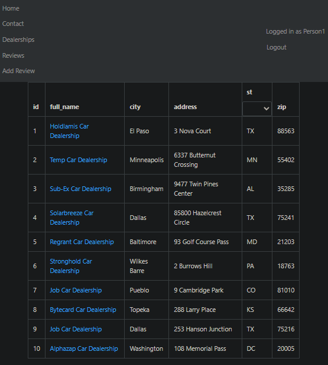
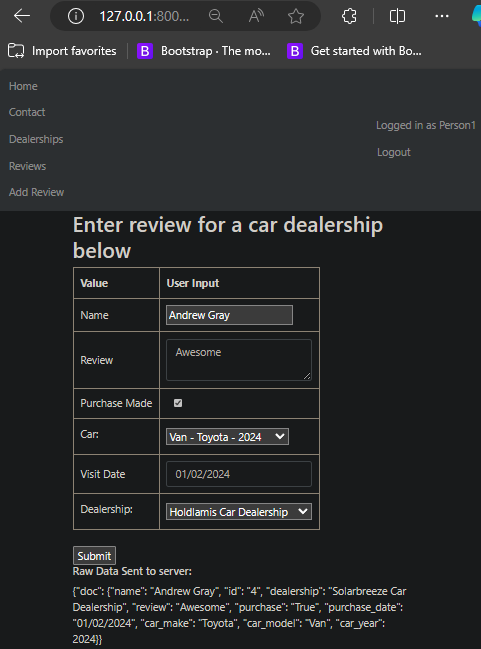

# Abstract

# Full Stack Final Project Website

This website is a full stack project that utilizes Django and Node.js with Express. For the coursera course on Django Cloud Development

- **Django:** Used for rendering a list of car dealerships and associated user reviews.
- **Node.js and Express:** Although the REST API for the course's IBM Cloud has been decommissioned,The raw JSON list of dealerships and users is still accessible from the IBM Cloud database. This data is used in the `./server/djangobackend/node_Dealership_example_server` A Node and Express server
  was made to enable the rest of the website.

# Project Concepts

-User Authentication
-Working with Django Forms,models, and ORM databases
-Frontend Bootstrap styling and dynamic interaction like table filters
-REST API calls to a database ( although the data could have been stored all in Django)

# Dealerships Data Table

Basic Data Table with criteria filter

filtered by state

User Sign up functionality

User logged in 

Form Submission sent to database

